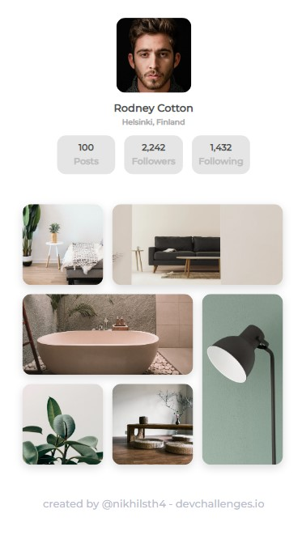

<h1 align="center">My gallery page</h1>

   Solution for a challenge from  <a href="http://devchallenges.io" target="_blank">Devchallenges.io</a>.

  <h3>
    <a href="https://my-gallery-dev.netlify.app/">
      Demo
    </a>
     | 
    <a href="https://github.com/nikhilsth4/devchallenges-my-gallery">
      Solution
    </a>
     | 
        <a href="https://devchallenges.io/challenges/gcbWLxG6wdennelX7b8I">
      Challenge
    </a>

  </h3>

<!-- TABLE OF CONTENTS -->

## Table of Contents

- [Overview](#overview)
  - [Built With](#built-with)
- [Features](#features)
- [Contact](#contact)

<!-- OVERVIEW -->

## Overview

It is a team using plain Html Css

### Built With

HTML, CSS

## Features

This application/site was created as a submission to a [DevChallenges](https://devchallenges.io/challenges) challenge. The [challenge](https://devchallenges.io/challenges/wBunSb7FPrIepJZAg0sY) was to build an application to complete the given user stories.

## Contact

- Website [nikhilshrestha0.com.np](https://nikhilshrestha0.com.np)
- GitHub [@nikhilsth4](https://github.com/nikhilsth4)
- Twitter [@nikhilsth4](https://twitter.com/your-nikhilsth4)
